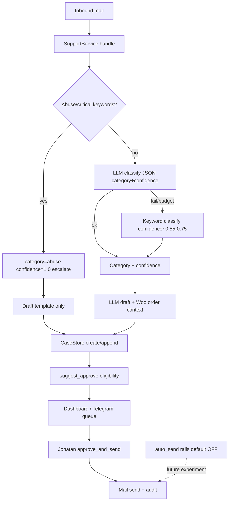

# feat: Cases & AI quality (Path B) — Implementation Plan

> **For agentic workers:** Execute unit-by-unit with TDD. Progress is derived from git, not checkboxes in this file. First slice = **U1** only unless the operator expands scope.

**Goal:** Raise triage/draft quality and cut Jonatan’s approve/send friction via hybrid classify, suggest-approve, and early auto-send guardrails — without enabling auto-send in production by default.

**Architecture:** Keep Cases 2.0 human-approve send path. Add classify confidence + suggest-approve eligibility on ingest; surface low-friction confirm UX on dashboard and Telegram; ship auto-send config/audit/kill-switch rails early with `auto_send_enabled: false`.

**Tech stack:** Python `ecom_ops` (support + cases + llm), SQLite cases.db migrations, Flask dashboard templates, Telegram OpenClaw commands, OpenRouter, pytest mocks.

---

## Goal Capsule

- **Objective:** Ship Path B capability over 4–6 weeks so routine order-status cases are faster to approve, with safer classification and rails for later auto-send experiments.
- **Authority:** Locked decisions in `docs/ideation/2026-07-11-azom-project-overview-next-steps-scope.md` override Cases v2 “auto-send: No” non-goal for *experiments*; human default remains unless an explicit flagged experiment is enabled by Oscar.
- **Stop conditions:** Do not build GA4/engagement, measurement-first programs, FAQ/KB, V3, or unscoped auto-send. Do not block on baseline capture.
- **First executable unit:** U1 (hybrid classify + confidence + suggest-approve eligibility + config rails skeleton).

---

## Product Contract

### Problem frame

Cases MVP works end-to-end (poll → draft → human approve → send), and LLM drafts already exist. Bottlenecks: keyword-only classify, no confidence/suggest-approve signal, thin triage UX, and no guardrails for future auto-send. Live VPS with real Woo + mail is already running.

### Actors

- A1. Jonatan — primary approve/send operator (CASE_REPLY).
- A2. Oscar — secrets, uptime, enable/disable experiment flags, kill-switch.
- A3. Agent automation — poll/ingest/draft as operator.

### Requirements

- R1. Hybrid classify: keyword gate for abuse/legal/critical; LLM (or keyword fallback) for remaining categories with a numeric confidence.
- R2. Stronger drafts: include real Woo order context in the LLM prompt when `order_id` is known (not only post-hoc prepend).
- R3. Suggest-approve: mark eligible cases so Jonatan can confirm with reduced friction; human still confirms before send.
- R4. First-safe types only: `order_status` (and optionally `shipping` when `order_id` present); never abuse/return/billing/refund disputes in v1 eligibility.
- R5. Guardrails for future auto-send: config flags, allowlist, confidence threshold, max sends/day, audit fields, Oscar-only enable, kill-switch — **default off**.
- R6. Triage UX on dashboard and Telegram (both; cheap parity).
- R7. RBAC + telemetry/audit on approve and any future auto-send path.
- R8. Thin parallel only: baseline note placeholder; Oscar live-ops hygiene only if blocking.

### Key flows

- F1. Ingest → hybrid classify → draft → persist confidence + `suggest_approve` → queue.
- F2. Jonatan opens suggestable case → one-confirm approve/send (dashboard or Telegram).
- F3. Oscar toggles experiment rails / kill-switch without code deploy when possible (config + env).

### Acceptance examples

- AE1. Abuse keyword message → category `abuse`, escalated, `suggest_approve=false`, no LLM classify required.
- AE2. Clear order-status with order id + high confidence → `suggest_approve=true`, draft present, human approve still required to send.
- AE3. With `auto_send_enabled=false`, no outbound send occurs without `approve_and_send` / Telegram approve / dashboard reply action.
- AE4. Return/refund complaint → not suggest-approve eligible even if LLM is confident.

### Scope boundaries

**In scope:** Hybrid classify, draft quality with order context, suggest-approve eligibility + UX, auto-send rails (disabled), light triage polish, thin baseline placeholder.

**Out of scope / parked:** GA4/engagement, measurement-first KPI program, FAQ/KB, IMAP IDLE, V3, SSO, CDN pin program, enabling auto-send by default.

**Deferred to follow-up:** Bulk queue actions, regenerate-draft button polish beyond U4/U5, edit-distance dashboards, daily-brief KPI redesign as a primary project.

---

## Planning Contract

### Assumptions (residual open questions resolved for planning)

| # | Question | Assumption |
|---|----------|------------|
| 1 | Highest-volume pain flow | Order-status first; shipping second when `order_id` present |
| 2 | First-safe suggest-approve types | `order_status`; add `shipping` only with `order_id` + confidence ≥ threshold |
| 3 | Never-eligible types | `abuse`, `return`, `billing`, and any escalated case |
| 4 | Approve surface priority | Both dashboard + Telegram (approve already exists on both) |
| 5 | Auto-send | Design/implement rails in U3; **do not enable** in prod default; experiment later behind Oscar flag |
| 6 | Confidence threshold | Default `0.80` for suggest-approve; configurable |
| 7 | LLM classify budget | Skip LLM classify when over OpenRouter cap; fall back to keywords with lower confidence |
| 8 | Baseline | Placeholder file/note only; do not block U1–U6 |

### Key technical decisions

- KTD1. Extend `SupportResult` with `confidence: float`, `classify_method: str` (`keyword` \| `llm` \| `hybrid`), keep `classify_message()` for keyword path / tests.
- KTD2. Persist `classify_confidence`, `classify_method`, `suggest_approve` on `cases` via schema version **3** (follow existing `_migrate` pattern).
- KTD3. Eligibility helper `is_suggest_approve_eligible(...)` pure function driven by `config/cases_ai.yaml` (new) — keep limits.yaml for cap only.
- KTD4. Auto-send rails live in same config (`auto_send_enabled: false`, allowlist, thresholds, `max_auto_sends_per_day`, `kill_switch_env: AZOM_AUTO_SEND_KILL`) before any sender code path.
- KTD5. Order-context drafts: fetch Woo order once on ingest and pass structured summary into `draft_support_with_llm` (reuse enrich helper logic; avoid double-fetch when cheap).
- KTD6. Suggest-approve UX = badge + shortened confirm copy; **does not** remove confirm dialog / Telegram intentional approve command.

### High-level technical design

### Phased delivery (4–6 weeks)

| Week | Focus | Units |
|------|-------|-------|
| 1 | Foundation | U1 |
| 1–2 | Draft quality + rails | U2, U3 |
| 2–3 | Suggest-approve UX | U4, U5 |
| 3–4 | Friction polish + regenerate | U6 |
| Parallel thin | Baseline note; Oscar blockers only | U7 |

---

## Implementation Units

### U1. Hybrid classify + confidence + suggest-approve eligibility

**Goal:** Classification returns confidence; cases persist eligibility; auto-send config skeleton exists and defaults to off.

**Requirements:** R1, R3, R4, R5 (config only), R7 (telemetry meta)

**Dependencies:** None

**Files:**
- Modify: `skills/ecom_ops/actions/support.py`
- Modify: `skills/ecom_ops/llm.py`
- Create: `config/cases_ai.yaml`
- Modify: `skills/ecom_ops/config.py` (load cases_ai)
- Create: `skills/ecom_ops/cases/suggest.py` (eligibility helper)
- Modify: `skills/ecom_ops/cases/store.py` (schema v3 + fields)
- Modify: `skills/ecom_ops/cases/service.py` (persist fields on ingest)
- Modify: `infrastructure/dashboard/templates/case_detail.html` (badge only)
- Modify: `skills/ecom_ops/bot/openclaw_commands.py` (badge in show/list)
- Test: `tests/test_support.py`, `tests/test_suggest_approve.py`, `tests/test_cases_v2.py` (migrate)

**Approach:**
- Keyword critical path unchanged for abuse (confidence 1.0, method `keyword`).
- Non-abuse: try `classify_support_with_llm` returning `{category, confidence}`; validate category enum; on failure use keyword classify with mid confidence.
- Compute `suggest_approve` via allowlist + threshold + `order_id` present + not escalated.
- Load `cases_ai.yaml` with safe defaults if missing.
- Do **not** implement auto-send caller; only config + helper stubs documenting rails.

**Execution note:** Implement test-first (TDD). Mock OpenRouter classify responses; never require live API in pytest.

**Patterns to follow:** `draft_support_with_llm` budget/telemetry pattern; `CaseStore._migrate` / `SCHEMA_VERSION`; Cases approve RBAC.

**Test scenarios:**
- Abuse keywords → abuse, confidence 1.0, suggest_approve false, escalated.
- Order-status text with order id + mocked LLM classify confidence 0.9 → suggest_approve true.
- Return/refund → suggest_approve false even at confidence 0.95.
- No API key / budget skip → keyword fallback, suggest_approve only if keyword path meets threshold rules (default: keyword confidence below threshold ⇒ false).
- Schema migrate adds columns; old rows read with defaults (`suggest_approve=false`, confidence null/0).
- `auto_send_enabled` default false in loaded config.

**Verification:** Targeted pytest modules pass; creating a case in mock poll persists new fields; dashboard/Telegram show suggest badge when true.

---

### U2. Stronger order-context drafts

**Goal:** LLM draft prompt includes Woo order status/total/currency (and safe fields only) when order is resolved.

**Requirements:** R2

**Dependencies:** U1

**Files:**
- Modify: `skills/ecom_ops/llm.py`
- Modify: `skills/ecom_ops/cases/service.py` (`_enrich_draft_with_order` / ingest)
- Test: `tests/test_llm_draft_context.py` (new) or extend support/cases tests

**Approach:** Resolve order once; pass compact context string into draft LLM; keep prepend block for template fallback path; never invent tracking numbers.

**Execution note:** TDD with mocked Woo client.

**Test scenarios:**
- With order → LLM user prompt contains status/total.
- Woo miss → draft still succeeds without order block crash.
- Template fallback still gets prepend enrichment.

**Verification:** Mock ingest produces order-aware draft path covered by tests.

---

### U3. Auto-send guardrails (rails only)

**Goal:** Production-safe config + audit hooks + kill-switch so a later experiment can enable auto-send without redesign.

**Requirements:** R5, R7

**Dependencies:** U1

**Files:**
- Modify: `config/cases_ai.yaml`
- Create: `skills/ecom_ops/cases/auto_send.py` (eligibility + kill-switch + daily counter interface)
- Modify: `skills/ecom_ops/cases/service.py` (optional no-op check point documented; **no automatic call from poll**)
- Test: `tests/test_auto_send_rails.py`

**Approach:**
- `auto_send_enabled: false` default.
- Allowlist subset of suggest-approve types; higher threshold (e.g. 0.92); `max_auto_sends_per_day`.
- Kill-switch: env `AZOM_AUTO_SEND_KILL=1` forces off.
- Oscar-only enable documented; prefer config file + env override.
- Audit telemetry action name reserved: `case_auto_sent` (unused until experiment).

**Test scenarios:**
- Enabled flag false → `should_auto_send` always false.
- Kill-switch overrides enabled true.
- Allowlist miss / low confidence / no order_id → false.
- Daily cap reached → false.

**Verification:** Tests prove defaults never send; no poll path calls auto-send.

---

### U4. Dashboard suggest-approve triage UX

**Goal:** Reduce Jonatan friction on eligible cases without removing human confirm.

**Requirements:** R3, R6

**Dependencies:** U1

**Files:**
- Modify: `infrastructure/dashboard/templates/cases.html`
- Modify: `infrastructure/dashboard/templates/case_detail.html`
- Modify: `infrastructure/dashboard/app.py` (pass flags / filter `suggest=1` optional)
- Test: light template/helper tests if present; else service-level eligibility already covered

**Approach:** Queue badge “Föreslå godkänn”; detail page highlights eligible draft; confirm copy shorter for suggestable cases; optional filter.

**Test scenarios:** Filter/list includes suggest_approve field in context; non-eligible unchanged.

**Verification:** Manual mock dashboard check + any existing dashboard tests.

---

### U5. Telegram suggest-approve surfacing

**Goal:** `/cases` list/show mark suggestable cases; approve command unchanged (still explicit).

**Requirements:** R3, R6

**Dependencies:** U1

**Files:**
- Modify: `skills/ecom_ops/bot/openclaw_commands.py`
- Test: extend bot command tests if present; else unit-test formatting helper

**Approach:** Prefix list lines with marker; show confidence; keep approve as explicit command (no silent send).

**Test scenarios:** Show text includes suggest marker when flag true; approve still calls `approve_and_send`.

**Verification:** Bot unit tests / formatting tests pass.

---

### U6. Triage friction extras (regenerate + confidence display)

**Goal:** Regenerate draft action + visible confidence so Jonatan trusts/skips faster.

**Requirements:** R2, R6

**Dependencies:** U2, U4

**Files:**
- Modify: cases service (regenerate), dashboard detail, optional Telegram
- Test: `tests/test_case_regenerate.py`

**Approach:** `regenerate_draft(case_id)` re-runs support draft with stored inbound text + order context; RBAC CASE_REPLY; telemetry `case_draft_regenerated`.

**Test scenarios:** Regenerate updates draft; denied without permission; abuse cases stay escalated.

**Verification:** pytest + mock dashboard action.

---

### U7. Thin parallel: baseline placeholder + blocking live-ops only

**Goal:** Do not block Path B; leave a place for Jonatan baseline when contactable.

**Requirements:** R8

**Dependencies:** None

**Files:**
- Create: `docs/ideation/baseline-capture-placeholder.md` (or short section update on overview)
- Touch ops only if live poll/mail/budget is actively broken

**Test expectation:** none — docs/ops only.

**Verification:** Placeholder exists; no engagement/GA4 work.

---

## Verification Contract

- Unit/integration: `pytest tests/test_support.py tests/test_suggest_approve.py tests/test_cases.py tests/test_cases_v2.py tests/test_case_kpis.py -q` (expand as units land).
- Full suite before merge of multi-unit PR: `pytest -q` with `AZOM_USE_MOCK=1`.
- Lint/coverage gates remain CI’s ruff + fail-under 65%.
- Manual live: after U4/U5, Jonatan confirms one suggestable order-status case on dashboard or Telegram; auto-send remains off.

## Definition of Done

- U1–U6 merged (U7 placeholder done in parallel).
- Suggest-approve used on safe types; human still confirms every send while auto-send disabled.
- Auto-send cannot fire with default config / kill-switch.
- Overview doc points at this plan; Cases v2 “auto-send: No” treated as superseded for *experiments only* with rails.
- No GA4/engagement code in this track.

---

## Risks & mitigations

| Risk | Mitigation |
|------|------------|
| LLM misclassify → wrong suggest | Abuse keyword gate; narrow allowlist; threshold; human confirm |
| Budget burn | Cap check before classify+draft; skip LLM classify when over cap |
| Accidental auto-send | Default false; kill-switch; no poll wiring in U1–U3 |
| Schema migrate on live DB | Additive columns only; follow SCHEMA_VERSION pattern |

---

## Sources & research

- Origin: `docs/ideation/2026-07-11-azom-project-overview-next-steps-scope.md` (locked Path B)
- Backlog: `docs/ideation/2026-07-11-azom-status-improvement-backlog.md` (E22–E23, H33)
- Spec: `docs/superpowers/specs/2026-07-11-cases-v2-design.md` (MVP; auto-send non-goal superseded for experiments)
- Code: `skills/ecom_ops/actions/support.py`, `llm.py`, `cases/service.py`, `cases/store.py`, dashboard `case_detail.html`, bot `/cases`

**External research:** Skipped — strong local patterns for LLM helpers, case migrate, and approve flows.

**Product Contract preservation:** Bootstrap from locked ideation doc (no separate requirements-only unified plan). Assumptions table records residual §8 answers.
